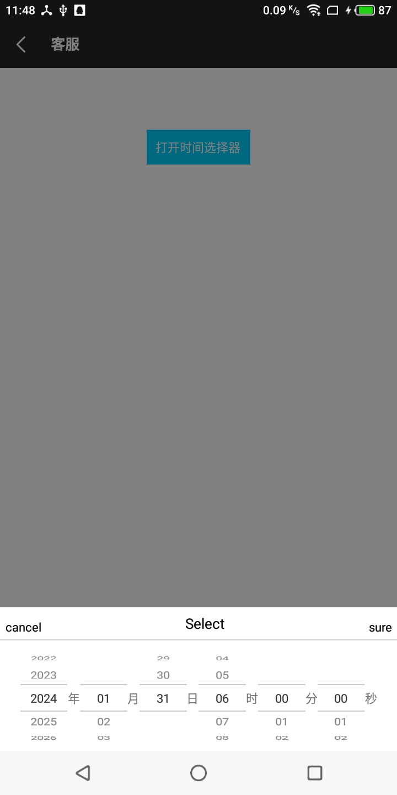

# rn-selector
基于[@rilyu/Teaset {Wheel}](https://github.com/rilyu/teaset/blob/master/components/Wheel/Wheel.js) 二次开发，封装时间选择器




#属性

```pickerType || 'dateTime'  类型  

   
    /* pickerType:
     *       date        =>年月日选择
     *       dateTime    =>年月日时分秒选择
     *       time        =>时分秒选择
     */
     
 itemHeight         单层item高度
 
 title || 'Select'  头部文字
 
 cancelTextStyle    取消文字样式
 
 cancelTouchStyle   取消触摸区域样式
 
 sureTextStyle      确定文字样式
 
 sureTouchStyle     确定触摸区域样式
 
 titleTextStyle     头部文字样式
 
 showUnit || true  是否显示文字（年月日）
 
 pickerTimeInterval || ['2019-01-01', '2029-01-01']   选择时间区间
 ```

 
 
#事件
```
onSure     确定 回调

onCancel   取消 回调
```


#例

```
 RNSelector.alertPicker('data', '确定', '时间选择器', '取消', (time) => {
                            //确定 返回（time）
                        }, () => {
                            //取消
                        })


